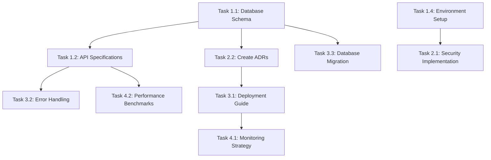

# ServiceNow Ticket Automation - Project Tasks

## Executive Summary

This document outlines all tasks required to complete the ServiceNow Ticket Automation project, based on the documentation gap analysis. Tasks are prioritized by criticality and organized by development phases.

## Project Overview

- **Project Name**: ServiceNow Ticket Automation System
- **Technology Stack**: React 18 + Vite + Tailwind CSS + Shadcn/ui + Node.js + TypeScript + PostgreSQL
- **Timeline**: 6 weeks for documentation and setup
- **Team Size**: 4-6 developers
- **Current Status**: Documentation phase (83% complete)

## Task Categories

### 🔴 **Critical Tasks** (Week 1)
### 🟡 **High Priority Tasks** (Weeks 2-3)
### 🟢 **Medium Priority Tasks** (Weeks 4-5)
### 🔵 **Low Priority Tasks** (Week 6)

---

## 🔴 Critical Tasks (Week 1)

### Task 1.1: Database Schema Design
**Priority**: CRITICAL  
**Owner**: Backend Developer  
**Timeline**: 2-3 days  
**Dependencies**: None

#### Subtasks:
- [ ] Design Entity Relationship Diagram (ERD)
- [ ] Define table structures and relationships
- [ ] Create database schema documentation
- [ ] Design data migration strategy
- [ ] Create sample data for testing
- [ ] Review with team and stakeholders

#### Deliverables:
- Database schema documentation
- ERD diagram
- Migration scripts
- Sample data files

#### Acceptance Criteria:
- All tables defined with proper relationships
- Schema supports all functional requirements
- Migration strategy documented
- Sample data provided for testing

---

### Task 1.2: API Specifications
**Priority**: CRITICAL  
**Owner**: Backend Developer  
**Timeline**: 3-4 days  
**Dependencies**: Task 1.1 (Database Schema)

#### Subtasks:
- [ ] Create OpenAPI/Swagger 3.0 specification
- [ ] Define all endpoint contracts
- [ ] Document request/response schemas
- [ ] Define error response formats
- [ ] Document authentication requirements
- [ ] Create example requests/responses
- [ ] Define rate limiting specifications

#### Deliverables:
- OpenAPI/Swagger specification file
- API documentation
- Example requests/responses
- Error code documentation

#### Acceptance Criteria:
- All endpoints documented with schemas
- Authentication requirements clear
- Error handling documented
- Examples provided for all endpoints

---

### Task 1.3: ServiceNow Integration Guide
**Priority**: CRITICAL  
**Owner**: ServiceNow Developer  
**Timeline**: 4-5 days  
**Dependencies**: None

#### Subtasks:
- [ ] Map ServiceNow table schemas
- [ ] Define field mappings
- [ ] Document API endpoint specifications
- [ ] Create Scripted REST API implementation
- [ ] Define rate limiting strategies
- [ ] Document error handling procedures
- [ ] Create integration testing guide

#### Deliverables:
- ServiceNow integration documentation
- Scripted REST API implementation
- Field mapping documentation
- Integration testing guide

#### Acceptance Criteria:
- All ServiceNow tables mapped
- API endpoints documented
- Scripted REST API implemented
- Error handling procedures defined

---

### Task 1.4: Environment Setup Guide
**Priority**: HIGH  
**Owner**: DevOps Engineer  
**Timeline**: 2-3 days  
**Dependencies**: None

#### Subtasks:
- [ ] Document prerequisites and system requirements
- [ ] Create step-by-step setup instructions
- [ ] Define required software versions
- [ ] Create configuration templates
- [ ] Document database setup process
- [ ] Create ServiceNow test environment guide
- [ ] Document Okta development tenant setup

#### Deliverables:
- Environment setup documentation
- Configuration templates
- Setup scripts
- Prerequisites checklist

#### Acceptance Criteria:
- Setup process documented step-by-step
- All configuration templates provided
- Prerequisites clearly defined
- Setup scripts tested and working

---

## 🟡 High Priority Tasks (Weeks 2-3)

### Task 2.1: Security Implementation Guide
**Priority**: HIGH  
**Owner**: Security Engineer  
**Timeline**: 3-4 days  
**Dependencies**: Task 1.4 (Environment Setup)

#### Subtasks:
- [ ] Document Okta application configuration
- [ ] Define JWT validation implementation
- [ ] Create CORS configuration guide
- [ ] Document input validation strategies
- [ ] Define rate limiting implementation
- [ ] Create security headers configuration
- [ ] Document secrets management strategy

#### Deliverables:
- Security implementation guide
- Okta configuration documentation
- JWT validation implementation
- Security best practices guide

#### Acceptance Criteria:
- Okta configuration documented
- JWT validation implemented
- Security best practices defined
- Input validation strategies documented

---

### Task 2.2: Create Missing ADRs
**Priority**: HIGH  
**Owner**: Technical Lead  
**Timeline**: 2-3 days  
**Dependencies**: Task 1.1 (Database Schema)

#### Subtasks:
- [ ] Create ADR-002: Database Technology Selection
- [ ] Create ADR-003: Authentication Strategy
- [ ] Create ADR-004: API Design Patterns
- [ ] Create ADR-005: Error Handling Strategy
- [ ] Create ADR-006: Deployment Strategy
- [ ] Create ADR-007: Monitoring Strategy

#### Deliverables:
- 6 Architecture Decision Records
- Technical decision documentation
- Implementation guidelines

#### Acceptance Criteria:
- All ADRs created and reviewed
- Decisions documented with rationale
- Implementation guidelines provided

---

### Task 2.3: Set up Project Structure
**Priority**: HIGH  
**Owner**: Full Stack Developer  
**Timeline**: 1-2 days  
**Dependencies**: None

#### Subtasks:
- [ ] Create backend directory structure
- [ ] Create frontend directory structure
- [ ] Set up package.json files
- [ ] Create basic configuration files
- [ ] Set up TypeScript configurations
- [ ] Create environment files
- [ ] Set up linting and formatting

---

### Task 2.4: Frontend Technology Setup
**Priority**: HIGH  
**Owner**: Frontend Developer  
**Timeline**: 2-3 days  
**Dependencies**: Task 2.3 (Project Structure)

#### Subtasks:
- [ ] Set up Vite with React and TypeScript
- [ ] Configure Tailwind CSS
- [ ] Install and configure Shadcn/ui
- [ ] Set up component library structure
- [ ] Create base UI components
- [ ] Configure development environment
- [ ] Set up testing framework

#### Deliverables:
- Complete project structure
- Package.json files
- Configuration files
- Environment templates

#### Acceptance Criteria:
- All directories created
- Package.json files configured
- TypeScript setup complete
- Linting and formatting configured

#### Deliverables:
- Vite configuration
- Tailwind CSS configuration
- Shadcn/ui setup
- Base component library
- Development environment

#### Acceptance Criteria:
- Vite development server running
- Tailwind CSS working with hot reload
- Shadcn/ui components available
- TypeScript compilation working
- Testing framework configured

---

## 🟢 Medium Priority Tasks (Weeks 4-5)

### Task 3.1: Deployment Guide
**Priority**: MEDIUM  
**Owner**: DevOps Engineer  
**Timeline**: 3-4 days  
**Dependencies**: Task 2.2 (ADRs)

#### Subtasks:
- [ ] Define infrastructure requirements
- [ ] Create deployment architecture
- [ ] Document CI/CD pipeline
- [ ] Create environment management guide
- [ ] Document production deployment process
- [ ] Create rollback procedures
- [ ] Document monitoring setup

#### Deliverables:
- Deployment guide
- CI/CD pipeline documentation
- Infrastructure requirements
- Production deployment process

#### Acceptance Criteria:
- Deployment process documented
- CI/CD pipeline configured
- Infrastructure requirements defined
- Rollback procedures documented

---

### Task 3.2: Error Handling Strategy
**Priority**: MEDIUM  
**Owner**: Backend Developer  
**Timeline**: 2-3 days  
**Dependencies**: Task 1.2 (API Specifications)

#### Subtasks:
- [ ] Define error scenarios and classifications
- [ ] Create handling strategies for each error type
- [ ] Document recovery procedures
- [ ] Define user-facing error messages
- [ ] Create logging and monitoring for errors
- [ ] Document error tracking strategy

#### Deliverables:
- Error handling strategy document
- Error classification guide
- Recovery procedures
- Error logging strategy

#### Acceptance Criteria:
- All error scenarios documented
- Handling strategies defined
- Recovery procedures clear
- Error logging configured

---

### Task 3.3: Database Migration Strategy
**Priority**: MEDIUM  
**Owner**: Backend Developer  
**Timeline**: 1-2 days  
**Dependencies**: Task 1.1 (Database Schema)

#### Subtasks:
- [ ] Create migration scripts and versioning
- [ ] Document rollback procedures
- [ ] Create data seeding strategy
- [ ] Define environment-specific configurations
- [ ] Create migration testing procedures

#### Deliverables:
- Migration strategy document
- Migration scripts
- Rollback procedures
- Data seeding scripts

#### Acceptance Criteria:
- Migration scripts created
- Rollback procedures documented
- Data seeding strategy defined
- Testing procedures established

---

## 🔵 Low Priority Tasks (Week 6)

### Task 4.1: Monitoring and Logging Strategy
**Priority**: LOW  
**Owner**: DevOps Engineer  
**Timeline**: 2-3 days  
**Dependencies**: Task 3.1 (Deployment Guide)

#### Subtasks:
- [ ] Define logging standards and formats
- [ ] Create monitoring metrics and KPIs
- [ ] Document alerting strategy
- [ ] Define performance monitoring
- [ ] Create error tracking strategy

#### Deliverables:
- Monitoring and logging strategy
- Logging standards document
- Monitoring metrics definition
- Alerting strategy

#### Acceptance Criteria:
- Logging standards defined
- Monitoring metrics established
- Alerting strategy documented
- Performance monitoring configured

---

### Task 4.2: Performance Benchmarks
**Priority**: LOW  
**Owner**: Backend Developer  
**Timeline**: 1-2 days  
**Dependencies**: Task 1.2 (API Specifications)

#### Subtasks:
- [ ] Define specific performance metrics
- [ ] Create acceptance criteria
- [ ] Document load testing strategy
- [ ] Define performance monitoring
- [ ] Create performance testing procedures

#### Deliverables:
- Performance benchmarks document
- Performance metrics definition
- Load testing strategy
- Performance testing procedures

#### Acceptance Criteria:
- Performance metrics defined
- Acceptance criteria established
- Load testing strategy documented
- Performance testing procedures created

---

## Task Dependencies

## Resource Allocation

### Team Members and Responsibilities:

| Role | Primary Tasks | Secondary Tasks |
|------|---------------|-----------------|
| **Backend Developer** | Database Schema, API Specs, Error Handling | Database Migration, Performance Benchmarks |
| **Frontend Developer** | Vite Setup, Tailwind Config, Shadcn/ui Components | UI/UX Design, Component Library |
| **ServiceNow Developer** | ServiceNow Integration | - |
| **DevOps Engineer** | Environment Setup, Deployment Guide | Security Implementation, Monitoring Strategy |
| **Security Engineer** | Security Implementation | - |
| **Technical Lead** | Create ADRs | Review all tasks |
| **Full Stack Developer** | Project Structure | Support other tasks |

## Timeline Overview

### Week 1: Foundation
- Database Schema Design (2-3 days)
- API Specifications (3-4 days)
- ServiceNow Integration Guide (4-5 days)
- Environment Setup Guide (2-3 days)

### Week 2-3: Implementation
- Security Implementation Guide (3-4 days)
- Create Missing ADRs (2-3 days)
- Set up Project Structure (1-2 days)
- Frontend Technology Setup (2-3 days)

### Week 4-5: Infrastructure
- Deployment Guide (3-4 days)
- Error Handling Strategy (2-3 days)
- Database Migration Strategy (1-2 days)

### Week 6: Optimization
- Monitoring and Logging Strategy (2-3 days)
- Performance Benchmarks (1-2 days)

## Success Metrics

### Documentation Completeness:
- **Week 1**: 90% (Critical gaps closed)
- **Week 3**: 95% (All major gaps addressed)
- **Week 6**: 98% (Complete documentation set)

### Quality Metrics:
- All documents reviewed and approved by stakeholders
- Technical specifications are actionable
- Examples and templates provided for implementation
- Documentation is version controlled and maintained

## Risk Mitigation

### High Risk Items:
- **ServiceNow Integration**: Requires ServiceNow developer expertise
- **Security Implementation**: Critical for production deployment
- **Database Schema**: Foundation for all backend development

### Mitigation Strategies:
- Early engagement with ServiceNow team
- Security review by security team
- Database schema review by DBA
- Regular stakeholder reviews

## Next Steps

1. **Assign task ownership** to team members
2. **Schedule kickoff meeting** for Week 1 tasks
3. **Set up project management tools** for task tracking
4. **Establish communication channels** for team collaboration
5. **Create task templates** for consistency
6. **Set up review process** for deliverables

## Conclusion

This task document provides a comprehensive roadmap for completing the ServiceNow Ticket Automation project. By following this structured approach, the team can systematically address all documentation gaps and set up the project for successful development.

The critical tasks in Week 1 will unblock development, while the subsequent weeks will ensure the project is properly configured for production deployment.
